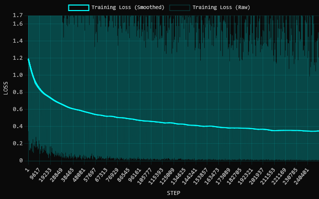
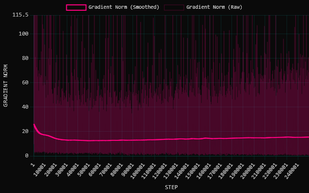

# Luau Qwen3 4B FIM v0.1

A specialized fine-tune of [Qwen/Qwen3-4B-Instruct-2507](https://huggingface.co/Qwen/Qwen3-4B-Instruct-2507) trained specifically for Fill-in-the-Middle (FIM) Luau code autocomplete, based on the formulation by Mohammad Bavarian et al. (OpenAI, 2022).

## Architecture & Format

- **Base Model:** `Qwen/Qwen3-4B-Instruct-2507`
- **Parameters:** ~4 Billion
- **Context Length:** 262,144 tokens (evaluated at 40k-262k)
- **Special Tokens:**
  - `<|fim_prefix|>` (ID: `151659`)
  - `<|fim_middle|>` (ID: `151660`)
  - `<|fim_suffix|>` (ID: `151661`)
  - `<|fim_pad|>` (ID: `151662`)
  - `<|repo_name|>` (ID: `151663`)
  - `<|file_sep|>` (ID: `151664`)

### Chat API Prompt Format
```json
[
  { "role": "system", "content": "You are a code completion assistant." },
  { "role": "user", "content": "<|repo_name|>{reponame}<|file_sep|>{filename}<|fim_suffix|>{suffix}<|fim_prefix|>{prefix}<|fim_middle|>" }
]
```

### Raw Completions Format
```text
<|im_start|>system
You are a code completion assistant.<|im_end|>
<|im_start|>user
<|repo_name|>{reponame}<|file_sep|>{filename}<|fim_suffix|>{suffix}<|fim_prefix|>{prefix}<|fim_middle|><|im_end|>
<|im_start|>assistant
```

## Training Methodology

- **Developer:** Zack Williams ([boatbomber](https://huggingface.co/boatbomber))
- **Sponsor:** Torpedo Software LLC
- **Dataset:** `TorpedoSoftware/the-luau-stack` (500,000 snippets formatted with StyLua)
- **LoRA Adapter:** Rank-Stabilized LoRA (rsLoRA) with rank $r=128$, $\alpha=128$ ($\gamma = 128 / \sqrt{128} \approx 11.31$)
- **Compute:** ~140 GPU hours on a single NVIDIA RTX 3090 (24GB VRAM)
- **Schedule:** 250,000 steps at batch size 2 (1 epoch over 500,000 examples)
- **Framework:** Unsloth

## Training Curves & Metrics

### Loss Curve


### Gradient Norm


### Quantization Evaluations (KL Divergence & Top-P Agreement)
- **Mean KL Divergence:** `assets/mean-kld.png`
- **Median KL Divergence:** `assets/median-kld.png`
- **99th Percentile KL Divergence:** `assets/99th-kld.png`
- **Same Top-P Agreement:** `assets/same-top-p.png`
